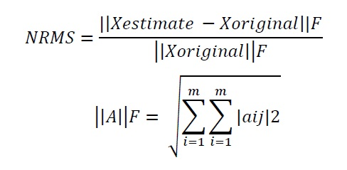

# Generalized-Regression-Neural-Network-Ensemble-for-Single-Imputation

The project deals with development of MATLAB code for single imputation of missing data using a generalized regression neural network for an unlabelled numerical dataset. The incomplete data set will be divided into a complete and incomplete dataset. Relieff algorithm will be applied to choose the optimal subsets. The subsets shall be used to train the GRNN, and the model will be fed to impute the missing data. NRMS will be calculated by comparing the imputed data sets with the original data sets. Moreover, the algorithm shall be analyzed for runtime against the data size and dimensions.

# INTRODUCTION

Missing data is common in large data and occurs due to nonresponse of certain respondents due to lack of information, or unwillingness to share. These form of missingness takes different types and different impacts on the analysis.
There are basically three major forms of missing values

1. Missing at Random(MAR)
Example: One of the gender may be less likely to disclose their weight
Probability that Y(output) is missing depends only on the value of X(Input)

2. Missing Completely at Random(MCAR)
Example: There is no particular reason why some respondents disclose their weights and others do not;
Probability that Y is missing depends only on the value of X

3. Missing Not at Random(MNAR)
Example: Light (or heavy) persons are less likely to disclose their weight
The probability that Y is missing depends on the unobserved value of Y itself.
There are two major methods to deal with missing value, listwise deletion and Imputation. Listwise deletion removes all data for the row having one or more missing value. However, this leads to reduction in the size of complete dataset. Hence, its important to impute the missing values.

The imputation can be single or multiple. In single imputation, each missing value is computed in a each for loop, whereas in multiple imputation generate multiple datasets, perform statistical analysis on them.
The method of GESI bifurcates the data into complete data and incomplete dataset. Then complete dataset is then used to train GRNN and the trained values are used to impute the missing dataset. To impute the missing value, we consider the column contain missing value as our output and the other columns are input. However, it becomes computationally time consuming in case of a large no of features. Hence, we apply Relieff algorithm to select 10 optimal feature subsets as input, which reduces computational time.

# RESULTS

The performance of the algorithm can be evaluated by computing the NRMS Value 

## Interesting highlights

1. The highest NRMS Value are obtained for CNP datasets with missing rate of 20%, since CNP dataset has only two features for compute. This showcases that having more number of features increases the computational accuracy.
2. Wine and glass datasets with missing rate of 1% -5% have extremely good NRMS values (less than 0.003).
3. Iris is the fastest data that was computed in 1.6 seconds whereas the DERM dataset took 1.4 hrs
4. Sonar datasets with missing rate of 20% had the highest number of missing values, however the computational time was 11 minutes only and an acceptable missing rate(less than 0.2).
5. The Relieff feature selection algorithm is the most time intensive. Hence faster and better feature selection algorithms could be used
6. The results can be improved further if the proposed algorithm is used in series with another missing value imputation algorithm. The NRMS values obtained after filling the dataset with nearest neighbour was 0.8 which was reduced to 0.2 by processing the results with GESI
